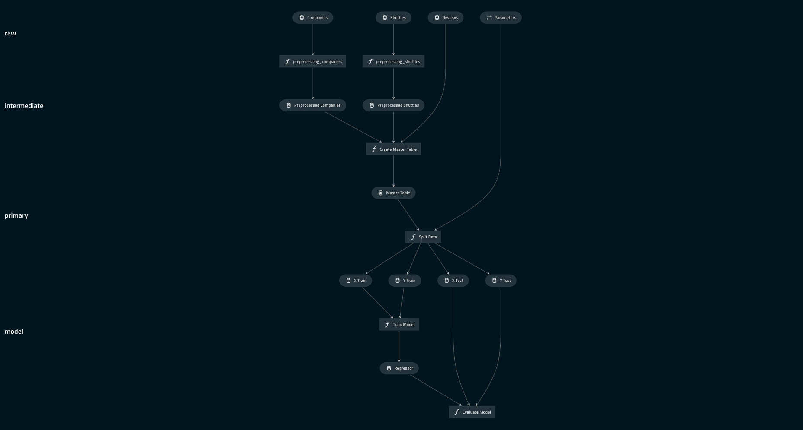

# Kedro starter for DAI (Data Analytics & Insight ) 


## Overview

Personally I use Cookiecutter to initiate data analytics project

Simply run : 

```bash
cookiecutter https://github.com/Dennis055/dai-analytics.git
```


```bash
pip install kedro==0.16.5
kedro new --starter git+https://github.com/Dennis055/dai-analytics.git
cd <my-project-name>  # change directory into newly created project directory
```

Install the required dependencies:

```bash
kedro install
```

Now you can run the project:

```bash
kedro run
```

To visualise the default pipeline, run:
```bash
kedro viz
```

This will open the default browser and display the following pipeline visualisation:


